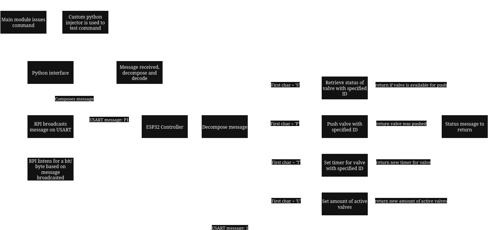
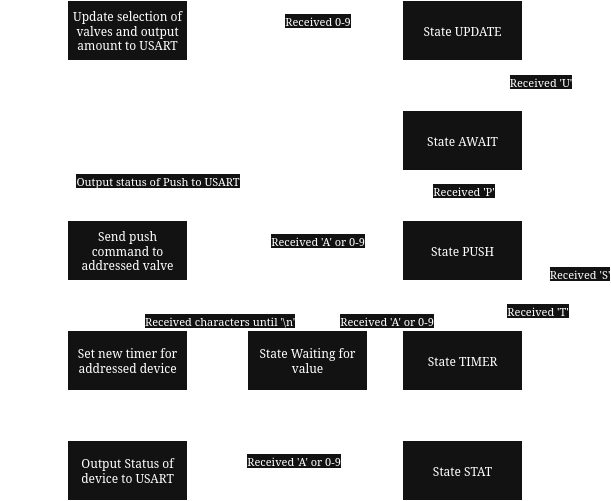

## ValveController

Valve controller is an ESP32 interface where communication between the microcontroller and mini computer 

### Message structure

The messages exchanged from RPI to ESP32 can follow this structure (without the underscores):

- "P_*ID*": P for Push, *ID* can be valve ID (like 1,2 etc) or **A** for all valves - returns bool 1/0 for succesful/valve-busy
- "S_*ID*": S for Status, *ID* can be valve ID (like 1,2 etc) or **A** for all valves - returns bool/array 1/0 for valve-available/valve-busy 
- "T_*ID*_*uS*\n": T for timer, *ID* can be valve ID (like 1,2 etc) or **A** for all valves, *uS* for timeout in μs - returns received timout
- "U_*VALVES*": U for update, *VALVES* represents the amount of active valves, for eg. Setting a value of 4 means that valves (1-4) are active while valves 5-6 are deactivated - returns the amount of active valves

### General architecture

The interfaceInjector.py is meant to be used as a wraper for valveInterface.py, the RPI endpoint of communication to the ESP32

### ESP32 state machine diagram

